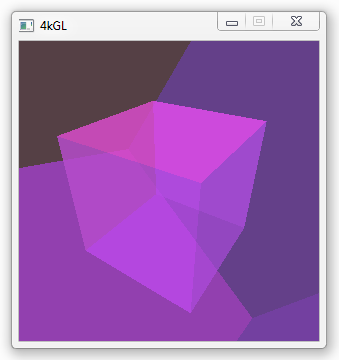

## About

This repository is just like the main [4kGL][] repository, except that it includes
a simple effect. It can be used to easily test different game loop
implementations or as a general test for 4kGL.

It's just two transparent cubes, one inside the other, rotating in
different directions. The camera is placed between them. It should
look like this:

[4kGL]: https://github.com/Beluki/4kGL

## Status

This program is finished!

4kGL-Example is feature-complete and has no known bugs. Unless issues are reported
I plan no further development on it other than maintenance.

